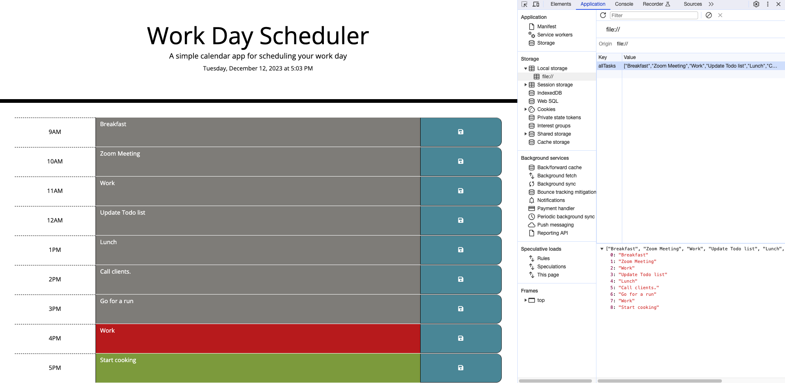

# daily-planner-app

## Description 
A daily planner app was created to allow users to save tasks/events for every working hour of the day. This application operates within the browser and incorporates dynamically updated HTML and CSS, driven by jQuery.

The URL of the deployed application: https://itismliu.github.io/daily-planner-app/

The URL of the GitHub repository: https://github.com/ItIsMLiu/daily-planner-app

Screenshot of webpage:

A starter code pack (as shown in the second commit) was provided, including the HTML and CSS files. Subsequently, the project was developed incorporating my newly acquired JavaScript knowledge. Below, I've highlighted the integration of these skills within the project:

- Jquery lanaguage and jquery ui
- DayJS

## Installation

N/A

## Usage 

To initiate the website experience, please follow the provided URL link. At the top section, you will find the current date and time. Nine time blocks, ranging from 9 AM to 5 PM, are displayed. Depending on the current time when the time block is viewed, it is color-coded as grey for the past, red for the present, and green for the future. Users can enter an event or task by clicking within a time block. To save the entered event or task, click the save button within that time block. Events and tasks are stored in local storage, ensuring that they persist even if the user refreshes the page.

## Credits

Other resources used as guides:
- getHours Method: https://www.w3schools.com/jsref/jsref_gethours.asp
- HTML DOM Element closest() Method: https://www.w3schools.com/jsref/met_element_closest.asp
- Conver String to Number: https://www.freecodecamp.org/news/how-to-convert-a-string-to-a-number-in-javascript/#:~:text=The%20unary%20plus%20operator%20(%20%2B%20)%20will%20convert%20a%20string%20into,will%20go%20before%20the%20operand.&text=We%20can%20also%20use%20the,into%20a%20floating%20point%20number.&text=If%20the%20string%20value%20cannot,the%20result%20will%20be%20NaN%20.
- Time out Function: https://www.w3schools.com/jsref/met_win_settimeout.asp
- String() method: https://www.w3schools.com/jsref/jsref_string.asp

## License

MIT license (Please refer to the LICENSE in the repository).
